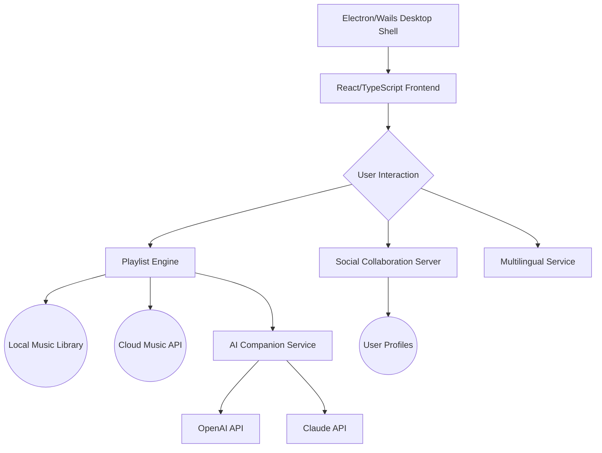

# 🐾 MewsicHub 🎶  
*Revolutionizing Music Playlists With AI, Community, and Catitude*

---

Welcome to **MewsicHub** – a purrfect blend of social music discovery, smart playlists, and AI-powered music companions! Built for modern music explorers, MewsicHub crafts enchanting playlists tailored by AI, lets you exchange track recommendations, and chat with music-loving AI assistants—right from your cross-platform desktop. Powered by Go, Wails, React, and TypeScript, MewsicHub ensures a seamless, high-performance, and playful listening journey, embracing multilingual accessibility and responsive workflows.

---

## 🌟 Key Features
- 🎵 **Cloud & Local Music Library Integration**  
  Combine your personal library with streaming APIs for endless vibes!

- 🤖 **OpenAI & Claude Conversational Companions**  
  Engage with smart music bots—get song tips, trivia, and mood-based suggestions.

- 🐱 **Social Playlist Collaboration**  
  Exchange curated playlists, rate tracks, and join themed "listening rooms."

- 🌏 **Multilingual Support**  
  Enjoy UI options in 18 languages—with seamless right-to-left text adaptation!

- 🎨 **Customizable, Responsive UI**  
  Adapt interface layouts, switch themes, and use accessibility scales.

- 📦 **Profile Sync Across Devices**  
  Keep preferences and playlists automatically updated wherever you tune in.

- 🕰️ **24/7 Catbot Support 🐈**  
  Smart, always-on support to troubleshoot, recommend music, or just keep you company!

- 🧩 **Extensible Plugin System**  
  Script your own playlist generators or genre explorers.

- 🌱 **Eco-Optimized Playback Engine**  
  Lightweight, efficient, and low on battery and bandwidth.

---

## 🔎 SEO-Friendly Keywords:
*music playlist manager, AI music assistant, desktop music collaboration, cross-platform music app, desktop playlist tool, music discovery with AI, OpenAI music chatbot, Claude API music, responsive music app, modern playlist curator, multilingual music desktop player*

---

## 🖼️ Mermaid Diagram: MewsicHub Architecture

---

## 📂 Example Profile Configuration

Below is a sample snippet from a user’s `mewsichub.config.json` profile:

    {
      "username": "catnaps",
      "theme": "midnight-paws",
      "preferred_language": "es",
      "library_paths": [
        "/Users/catnaps/Music",
        "/Volumes/MewsicDrive/Tracks"
      ],
      "ai_assistant": "Claude",
      "synced_playlists": [
        "Chill Hiss",
        "Synthwave Alley Cat"
      ],
      "collaboration_rooms": [
        "Dream Pop Exchange",
        "Jazz Night Owls"
      ]
    }

---

## 💻 Example Console Invocation

    $ mewsichub --sync --start-room "Jazz Night Owls" --theme pawsitive-mode --lang jp

- This will launch MewsicHub, synchronize cloud & local profiles, join the "Jazz Night Owls" collaborative room, set your interface to "pawsitive-mode" dark theme, and display the UI in Japanese.

---

## 🖥️ OS Compatibility Table

| Operating System    | Native App | Auto-Updates | Notifications | Touchscreen Support |
|---------------------|:----------:|:------------:|:-------------:|:------------------:|
| Windows 11/10       |     ✅     |      ✅      |      ✅       |        ✅          |
| macOS 14/13+        |     ✅     |      ✅      |      ✅       |        ✅          |
| Ubuntu 22.04+       |     ✅     |      ✅      |      ✅       |        ❌          |
| Fedora 39+          |     ✅     |      ✅      |      ✅       |        ❌          |
| Arch Linux rolling  |     ✅     |      🚧      |      ✅       |        ❌          |

---

## ✨ Feature Overview

### 🕹️ Effortless Playback
- Automated crossfading and gapless playback
- Smart queueing by genre, mood, or collaborative votes

### 🤝 Collaboration in Real-Time
- Invite friends to themed “rooms”
- Synchronized listening experience across continents

### 🤖 AI-Powered Recommendations
- Both **OpenAI** and **Claude API** options for maximum variety
- Daily “Surprise Me” playlists based on recent listening
- Natural language search: *"Mix me a moody coffee shop jazz playlist!"*

### 🌍 Multilingual Power
- 18 full languages, incl. Chinese, Japanese, Spanish, Russian, Arabic, and more
- Language auto-detect via OS settings

### 🔒 Robust Privacy
- All user profile and playlist data are encrypted at rest
- You control which social features to enable

### 💡 24/7 Catbot Support
- *MewsicBot* is ready to chat about issues or just swap music facts

---

## 🧠 AI & API Integration

**MewsicHub features seamless integration with:**
- **OpenAI GPT models**: For natural music chat, lyrics analysis, and trivia.
- **Claude v3 API**: For creative playlist curation and playlist mood descriptions.

API keys can be inserted during first-run setup or edited in your config file.

---

## 🏁 Quick Start & Download

:arrow_down: Begin your MewsicHub journey!

**Download the latest portable version:**  

**Or build from source following [BUILDING.md](BUILDING.md)**

---

## ⚠️ Disclaimer

*All song rights remain with their original publishers. MewsicHub is a music collaboration and playlist discovery utility—no unauthorized song distribution takes place. Check your local streaming service’s policy about API use. MewsicHub, its contributors, and community members are not responsible for music shared outside your personal use or region’s applicable law.*

---

## 📜 License

MewsicHub is licensed under the **MIT License** – see [LICENSE](LICENSE) for details.  
Copyright Ⓒ 2026 MewsicHub

---

## 🎸 Encore: Download Instructions

Revisit the magic!  

---

*MewsicHub – An intelligent, playful, and community-driven way to rediscover your music, powered by 2026 innovation.*